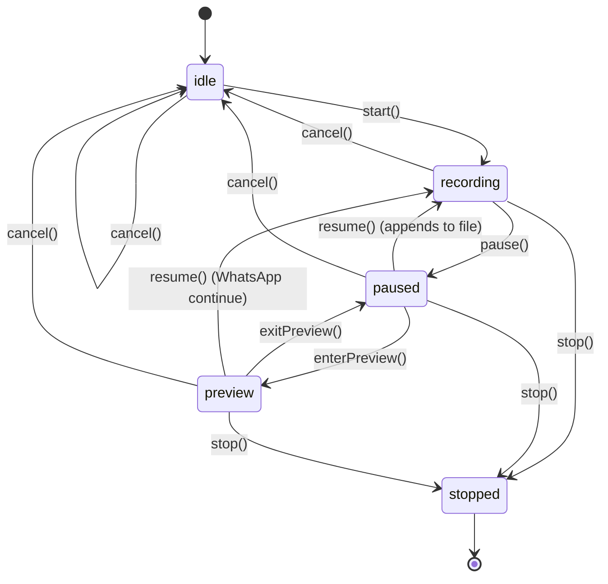

# react-native-waveform-recorder — v0.1 to v1.0 plan

## Goals & non-goals

- **Goals**: best perf (native render, no JS hot path), best DX (one component, zero JS peer deps, controlled+uncontrolled, imperative ref), drop-in WhatsApp/IG/Messenger/Slack-style flows, pairs with [react-native-waveform-player](https://github.com/maitrungduc1410/react-native-waveform-player).
- **Non-goals**: streaming uploads, multi-track mixing, recording effects/filters (leave to `react-native-audio-api`), JS-side custom renderers, old-arch support.

## Architecture (mirror the player project)

- Fabric-only view component via codegen; new arch only (RN 0.85+).
- Kotlin (Android) + Swift behind `.mm` bridge (iOS), same shape as the player project's `AudioWaveformView.mm` / `AudioWaveformView.kt` (see [react-native-waveform-player](https://github.com/maitrungduc1410/react-native-waveform-player)).
- **Zero JS peer deps** (no reanimated/svg/gesture-handler/vector-icons).
- Lib is **self-contained** — copy/fork the bar-renderer, decoder, and player-engine files from the player project into this repo so the recorder can run preview without depending on the player package. Both libs stay independent.
- Hybrid preset strategy: lib stays unopinionated (only color/shape primitives), example app + README recipes ship ready-to-copy themed components (WhatsApp/Messenger/IG/Slack/TikTok/Zalo).

## State machine




The `stopped` transition fires `onComplete` with the final file URI + WhatsApp-compatible 64-sample array.

## Native module layout

### iOS (`ios/`)

- `WaveformRecorderView.h` / `.mm` — Fabric bridge, prop/event/command routing (model: player project's `AudioWaveformView.mm`).
- `WaveformRecorderViewImpl.swift` — composite UIView; owns engine + bars view + button + timer; subscribes to `UIApplication` lifecycle.
- `AudioRecorderEngine.swift` — wraps `AVAudioRecorder` (m4a/aac) and `AVAudioEngine`+`AVAudioFile` (wav/PCM). Exposes `start/pause/resume/stop/cancel`, `enterPreview/exitPreview`, `togglePreviewPlayback`, `seekPreview`. Polls `averagePower(forChannel:)` on a `CADisplayLink` at `meterUpdatesPerSecond`. Manages `AVAudioSession.record`/`.playAndRecord`.
- `WaveformBarsView.swift` — fork of the player project's `WaveformBarsView.swift` with three additions: (1) `append(amplitude:)` ring buffer, (2) `recordingMode` (`scroll`/`morph`/`centered`), (3) dotted "future" bar style via `futureBarStyle`.
- `WaveformDecoder.swift` + `AudioPlayerEngine.swift` + `PlayPauseButton.swift` — copy verbatim from player project (used only in `preview` state).
- `RecorderGestureHandler.swift` — `UIPanGestureRecognizer` for slide-to-cancel + slide-to-lock (v0.3).

### Android (`android/src/main/java/com/waveformrecorder/`)

- `WaveformRecorderPackage.kt` — already scaffolded ([WaveformRecorderPackage.kt](../../android/src/main/java/com/waveformrecorder/WaveformRecorderPackage.kt)).
- `WaveformRecorderViewManager.kt` — Fabric view manager; mirror the player project's `AudioWaveformViewManager.kt`.
- `WaveformRecorderView.kt` — composite `FrameLayout`, `LifecycleEventListener`; mirror the player project's `AudioWaveformView.kt` structure.
- `AudioRecorderEngine.kt` — wraps `MediaRecorder` (m4a/aac, pause/resume on API 24+) and `AudioRecord` (wav/PCM via custom WAV header writer). Polls `getMaxAmplitude()` or RMS over PCM buffer.
- `WaveformBarsView.kt` — fork of the player project's `WaveformBarsView.kt` with `appendAmplitude` + `recordingMode` + `futureBarStyle` like iOS.
- `WaveformDecoder.kt`, `AudioPlayerEngine.kt`, `PlayPauseButton.kt`, `SpeedPillView.kt` — copy from player project for preview state.
- `RecorderGestureHandler.kt` — view-level pan handler (v0.3).

### TypeScript (`src/`)

- [src/WaveformRecorderViewNativeComponent.ts](../../src/WaveformRecorderViewNativeComponent.ts) — codegen NativeProps + NativeCommands. Use `-1` sentinels for controlled props as in the player project's `AudioWaveformViewNativeComponent.ts`.
- [src/WaveformRecorderView.tsx](../../src/WaveformRecorderView.tsx) (rename to `.native.tsx` + add web stub like player does) — public `WaveformRecorderView` wrapper, props translation, imperative ref via `useImperativeHandle`.
- [src/index.tsx](../../src/index.tsx) — re-export component + types.
- `package.json` `codegenConfig` already set ([package.json](../../package.json)).

## Public API (final v1 shape)

```ts
type WaveformRecorderState =
  | 'idle' | 'recording' | 'paused' | 'preview' | 'stopped' | 'error';

type RecorderOutputFormat = 'm4a' | 'aac' | 'wav' | 'opus';

type WaveformRecorderViewProps = Omit<ViewProps, 'children'> & {
  // recording config
  output?: {
    uri?: string;
    format?: RecorderOutputFormat;      // default 'm4a'
    sampleRate?: number;                // default 44100
    channels?: 1 | 2;                   // default 1
    bitrate?: number;                   // default 128000
    quality?: 'low' | 'medium' | 'high';
  };
  maxDurationMs?: number;
  minDurationMs?: number;

  // visual (mirror player props 1:1)
  playedBarColor?: ColorValue;
  unplayedBarColor?: ColorValue;
  futureBarColor?: ColorValue;
  barWidth?: number; barGap?: number; barRadius?: number;
  containerBackgroundColor?: ColorValue;
  containerBorderRadius?: number;
  showBackground?: boolean;
  showTime?: boolean; timeColor?: ColorValue; timeMode?: 'count-up' | 'count-down';

  // recording-specific visual
  recordingMode?: 'scroll' | 'morph' | 'centered';
  futureBarStyle?: 'dot' | 'line' | 'hidden';
  newSampleEntry?: 'grow' | 'fade' | 'none';
  meterUpdatesPerSecond?: number;       // default 30
  samplesPerSecond?: number;            // default 12 (visual)

  // preview integration
  enablePreview?: boolean;              // default true
  enableContinueRecording?: boolean;    // default true (WhatsApp-style)

  // gestures (v0.3)
  enableSlideToCancel?: boolean;
  slideToCancelThresholdDp?: number;
  enableSlideToLock?: boolean;
  slideToLockThresholdDp?: number;

  // auto behavior (v0.3)
  silenceThresholdDb?: number;
  silenceTimeoutMs?: number;

  // controlled
  state?: WaveformRecorderState;

  // events
  onStateChange?: (e: { state: WaveformRecorderState; durationMs: number }) => void;
  onMeter?: (e: { amplitude: number; peak: number; db: number }) => void;
  onSamples?: (e: { samples: number[] }) => void;
  onComplete?: (e: {
    uri: string; durationMs: number; format: RecorderOutputFormat;
    mimeType: string; sizeBytes: number; sampleRate: number; channels: number;
    samples: number[];          // WhatsApp-compatible 64
    peakAmplitude: number;
  }) => void;
  onSilenceDetected?: () => void;
  onMaxDurationReached?: () => void;
  onSlideCancel?: () => void;
  onSlideLock?: () => void;
  onPermissionDenied?: () => void;
  onError?: (e: { message: string; code?: string }) => void;
};

type WaveformRecorderViewRef = {
  start: () => void;
  pause: () => void;
  resume: () => void;
  stop: () => void;
  cancel: () => void;
  enterPreview: () => void;
  exitPreview: () => void;
  togglePreviewPlayback: () => void;
  seekPreview: (positionMs: number) => void;
  getSamples: () => Promise<number[]>;
  getDurationMs: () => Promise<number>;
};
```

## Phased roadmap

### v0.1 — MVP (record-only)

- iOS `AVAudioRecorder` + Android `MediaRecorder` engines, m4a only.
- Live scrolling bars (`recordingMode: 'scroll'`), dotted future bars.
- `start/pause/resume/stop/cancel` commands; `onStateChange`, `onMeter`, `onComplete` (samples included).
- Basic theming props identical to player. Permission request handled inside `start()`; emits `onPermissionDenied` on failure.

### v0.2 — Preview & continue-recording (the headline UX)

- Fold copied player files into recorder; switch to `AudioPlayerEngine` when state enters `preview`.
- Implement `enterPreview/exitPreview/togglePreviewPlayback/seekPreview` commands.
- Implement `resume()` from `preview` so WhatsApp/Messenger "continue recording" works natively (AVAudioRecorder pause/record; MediaRecorder pause/resume on API 24+).
- Scrubbable preview waveform reuses player's scrub gesture code.

### v0.3 — Output formats, gestures, auto-behavior

- Add `wav` via `AudioRecord` + WAV header writer (Android) / `AVAudioEngine`+`AVAudioFile` (iOS).
- Add `opus` (Android: `MediaRecorder` `OPUS` encoder on API 29+; iOS: `AVAudioRecorder` `kAudioFormatOpus` on iOS 11+).
- `aac` raw container option.
- Slide-to-cancel / slide-to-lock native gesture handlers + `onSlideCancel`/`onSlideLock` events.
- Silence detection driving `onSilenceDetected` + optional auto-stop.

### v1.0 — Polish, docs, demo

- Background recording: configure `AVAudioSession.record` + optional Android foreground-service helper.
- Long-recording stress tests (30+ min) on both platforms.
- Optional raw-PCM JSI stream (opt-in extension for STT/Whisper); ship as a separate import so it doesn't bloat the default bundle.
- README rewrite with full prop/event/command tables (mirror the [react-native-waveform-player README](https://github.com/maitrungduc1410/react-native-waveform-player#readme)).
- `recipes/` folder with copy-paste themed components.
- Publish; ensure `peerDependencies` stays at just `react` + `react-native`.

## Comprehensive example app

Replace [example/src/App.tsx](../../example/src/App.tsx) with a stack navigator (or simple `ScrollView` tabs, like the [react-native-waveform-player example app](https://github.com/maitrungduc1410/react-native-waveform-player/tree/main/example)) showcasing:

**Section A — Primitives (1 screen, multiple demos in scroll, like player's app)**

1. Default look — uncontrolled, m4a, default theme.
2. Themed — custom colors, bar shape, container radius.
3. `recordingMode` showcase — scroll vs morph vs centered toggle.
4. `futureBarStyle` showcase — dot vs line vs hidden toggle.
5. Controlled state — external buttons drive `state` prop.
6. Imperative ref — external buttons call `ref.start()/pause()/resume()/stop()`.
7. Output format toggle — m4a / wav / opus, shows resulting URI + size.
8. Long-recording test — 10-min timer + memory counter.
9. Event log — every event printed live.

**Section B — Real-world themed screens (separate screens, "recipes")**

1. **WhatsApp** — full chat mock; tap mic to start; pause shows preview with red mic to continue; trash/send buttons; uses `enableContinueRecording`.
2. **Messenger** — bottom-sheet preview with "Slide finger on recording to play from any point" hint; continue-record mic+ icon.
3. **Instagram** — solid blue pill; dotted future bars; "edit" + "New" pill stubs; send button.
4. **Slack** — compact pill with X/checkmark; keyboard remains open (no preview, immediate send).
5. **TikTok** — minimal pill: trash / scrolling waveform / send.
6. **Zalo** — three-button row (Delete / Send / Preview) under recording pill.

Each themed screen is implemented as a single ~80-line component the user can copy/paste; we explicitly link to each from the README "Recipes" section.

**Section C — Advanced (v0.3+ screens)**

1. Slide-to-cancel / slide-to-lock playground.
2. Silence detection demo (auto-stops after 2s of silence).
3. WhatsApp-compatible 64-sample export — shows the array + a `<View>`-based static render of it.

Example app uses `@react-navigation/native` + `@react-navigation/native-stack` (added to **example workspace only**, never to lib peer deps).

## Docs & publishing

- TypeScript: `tsc` clean (already wired in [package.json](../../package.json) `typecheck`).
- README: prop table, event table, command table, recipes section, side-by-side comparison with simform/nitro-sound/waveforms.
- CI: lint + typecheck + Android build + iOS build (lefthook already configured).
- Publish to npm under same author/scope as player; verify codegen output is in the published tarball.
- (Automated tests intentionally deferred — will be added in a separate future plan.)

## Notes / decisions to revisit

- We're forking player's `WaveformBarsView`/`AudioPlayerEngine`/`WaveformDecoder` into this lib (instead of depending on `react-native-waveform-player`). Both libs stay independent.
- Opus support per-platform is gated by OS version — document fallback to m4a clearly.
- WhatsApp 64-bucket sample export uses simple bucketed RMS, not the proprietary dB curve (good enough for visual parity; document this caveat).

