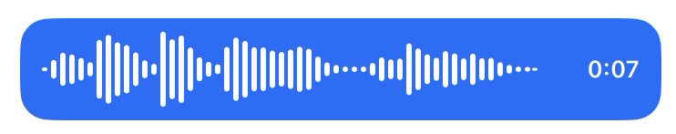

# react-native-waveform-recorder

A React Native audio recorder with a **native live waveform**, pause and resume, in-place preview with scrubbing, continue recording after preview, slide-to-cancel and slide-to-lock gestures, silence detection and a 64-bar export ready for chat bubbles. Built for the New Architecture (Fabric); nothing runs in JavaScript per frame.

<p align="center">
  <a href="https://maitrungduc1410.github.io/react-native-waveform-recorder/"><strong>📖 Documentation</strong></a> •
  <a href="https://maitrungduc1410.github.io/react-native-waveform-recorder/guide/quick-start">Quick start</a> •
  <a href="https://maitrungduc1410.github.io/react-native-waveform-recorder/guide/demo">Browser demo</a> •
  <a href="https://maitrungduc1410.github.io/react-native-waveform-recorder/api/">API reference</a> •
  <a href="https://maitrungduc1410.github.io/react-native-waveform-recorder/vi/">Tiếng Việt</a> •
  <a href="https://maitrungduc1410.github.io/react-native-waveform-recorder/zh/">简体中文</a>
</p>

<div align="center">
    
</div>

Pairs with [`react-native-waveform-player`](https://maitrungduc1410.github.io/react-native-waveform-player/) for playback: pass `onComplete.uri` and `onComplete.samples` to it and the player skips decoding the file. Works with Expo development builds (not Expo Go).

## Demo

| iOS | Android |
| :---: | :---: |
| <video src="https://github.com/user-attachments/assets/683227e2-3f87-4b31-b4ce-7c3a43aae9c6" controls loop muted></video> |<video src="https://github.com/user-attachments/assets/6e84d929-5fe0-4198-8379-6c4a3b73b3e4" controls loop muted></video> |

## Features

- **Native live waveform**: bars drawn in Swift and Kotlin from the microphone level, with configurable colors, sizes, timer and placeholder ticks
- **Pause, preview, continue**: pause and resume, listen back with scrubbing, then record more; segments are joined into one file
- **Slide to cancel or lock**: native drag tracking with progress events for your own hints
- **Silence detection**: an event after a quiet stretch, optionally stopping automatically
- **64-bar export**: `onComplete.samples` is ready for a chat-bubble waveform
- **Formats**: `m4a`, `aac`, `wav` and `opus`
- **Raw PCM stream**: opt-in 16-bit PCM chunks while recording WAV, from the `/pcm-stream` subpath
- **Background recording**: iOS background audio and an Android foreground service

## Install

```sh
npm install react-native-waveform-recorder
# or
yarn add react-native-waveform-recorder

# iOS
npx pod-install
```

Requires the New Architecture. Add `NSMicrophoneUsageDescription` to your iOS `Info.plist`; Android's `RECORD_AUDIO` is declared by the library and requested on `start()`. For Expo, add `"react-native-waveform-recorder"` to `plugins` and rebuild your development client. Background recording and the config plugin options are covered in the [installation guide](https://maitrungduc1410.github.io/react-native-waveform-recorder/guide/installation).

## Quick start

```tsx
import { useRef } from 'react';
import { Button, View } from 'react-native';
import {
  WaveformRecorderView,
  type WaveformRecorderViewRef,
} from 'react-native-waveform-recorder';

export function VoiceNote() {
  const ref = useRef<WaveformRecorderViewRef>(null);
  return (
    <View>
      <WaveformRecorderView
        ref={ref}
        style={{ height: 56 }}
        onComplete={(e) => {
          // Copy e.uri somewhere permanent: cancel() or unmounting the view deletes the session files.
          console.log('saved:', e.uri, e.durationMs, e.samples.length);
        }}
      />
      <Button title="Record" onPress={() => ref.current?.start()} />
      <Button title="Stop" onPress={() => ref.current?.stop()} />
    </View>
  );
}
```

## Documentation

Everything else lives on the documentation site: **https://maitrungduc1410.github.io/react-native-waveform-recorder/**

- [Props](https://maitrungduc1410.github.io/react-native-waveform-recorder/guide/props), [events](https://maitrungduc1410.github.io/react-native-waveform-recorder/guide/events) and [ref methods](https://maitrungduc1410.github.io/react-native-waveform-recorder/guide/ref-methods)
- [Segments, pause and preview](https://maitrungduc1410.github.io/react-native-waveform-recorder/guide/segments)
- [Slide gestures](https://maitrungduc1410.github.io/react-native-waveform-recorder/guide/gestures) and [silence detection](https://maitrungduc1410.github.io/react-native-waveform-recorder/guide/silence-detection)
- [Export and the player](https://maitrungduc1410.github.io/react-native-waveform-recorder/guide/export) and the [PCM stream](https://maitrungduc1410.github.io/react-native-waveform-recorder/guide/pcm-stream)
- [Platform notes](https://maitrungduc1410.github.io/react-native-waveform-recorder/guide/platform-notes) and [troubleshooting](https://maitrungduc1410.github.io/react-native-waveform-recorder/guide/troubleshooting)

A demo app with recipe screens is in [`example/`](./example/src/). Design notes are in [ARCHITECTURE.md](./ARCHITECTURE.md) and [LESSONS_LEARNED.md](./LESSONS_LEARNED.md).

## Contributing

See [CONTRIBUTING.md](CONTRIBUTING.md). The docs site source is in [`docs/`](./docs/); run `yarn docs:dev` to work on it.

## License

MIT
